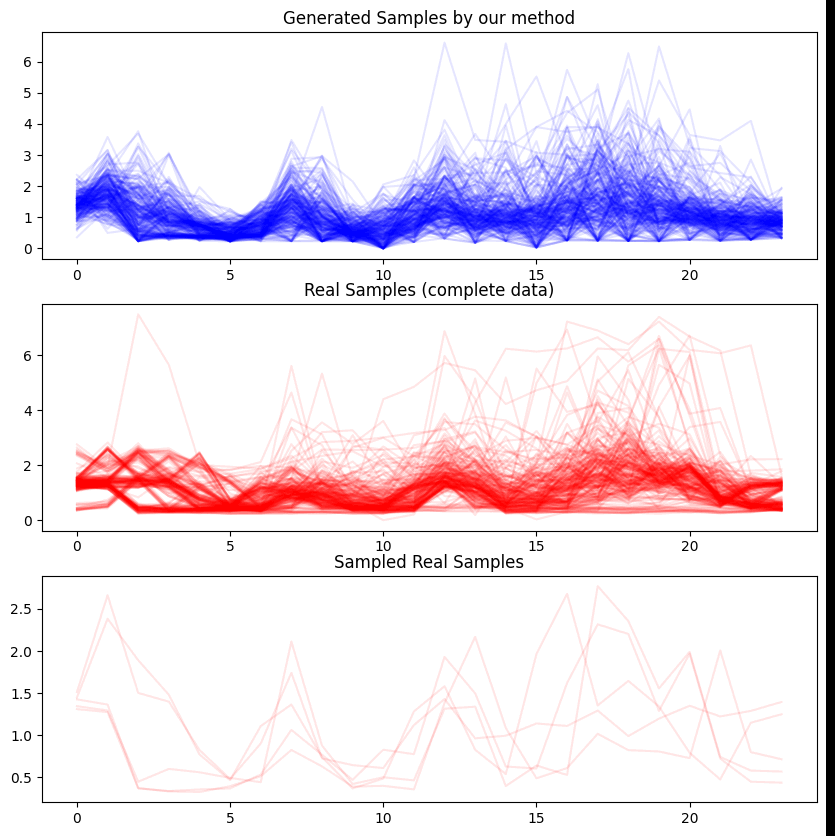
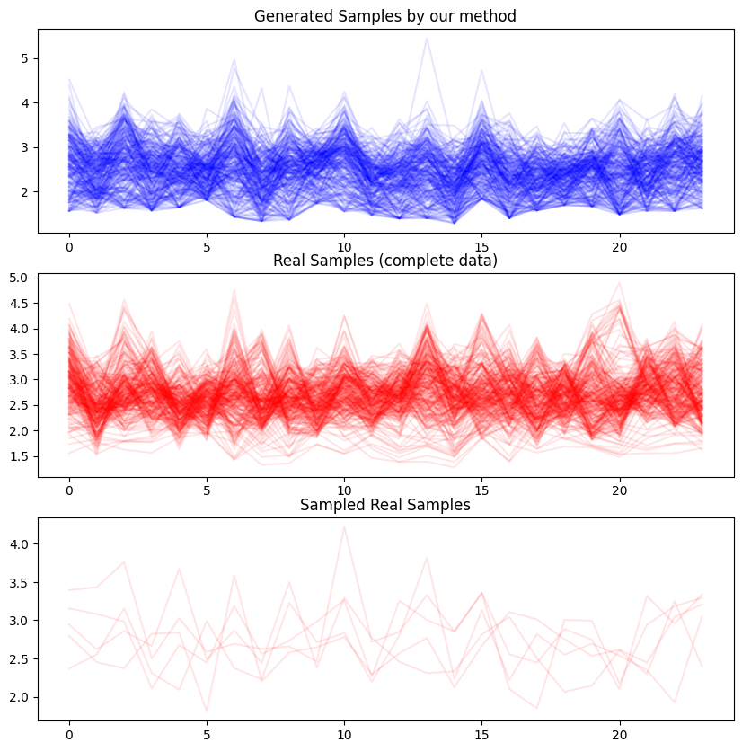

# An Efficient and Explainable Transformer-Based Few-Shot Learning for Modeling Electricity Consumption Profiles Across Thousands of Domains

<p align="center">
  
</p>


This is the official repository for the paper *An Efficient and Explainable Transformer-Based Few-Shot Learning for Modeling Electricity Consumption Profiles Across Thousands of Domains*.

- A Technical Appendix as a complementary resource for the main paper is available [here](materials/Technical_Appendix.pdf).
- You can use our pre-trained model for inference on time series data by following the instructions below or in [example](example.py).
- The code for training will be available soon.
- The complete dataset will be avaliable soon.

## How to Use the Pre-Trained Model for Inference

#### Creating Environment

First, creating a virtual environment and activate:
```bash
conda create --name gmm_trans python=3.9.19
conda activate gmm_trans
```

#### Installing Package
Installing our package by running the following command:

```bash
pip install git+https://github.com/xiaweijie1996/TransformerEM-GMM.git

```
#### Import Necessary Packages

```bash
from gmm_trans_package import plot_eva as pe
from gmm_trans_package import GMMsTransPipeline, load_valdata_example
import torch
```

#### Create the Pipeline
```bash
# create the pipeline
pipeline = GMMsTransPipeline()
encoder, para_emb, token_emb = pipeline.from_pretrained(n_components=6, resolution=24)
```

#### Inference with Real Electricity Consumption Profile (ECP) Data
Part of the validation dataset is provided for inference.
```bash
num_of_shot = 5
dataloader = load_valdata_example()
_val_data = dataloader.load_vali_data(size=1)
gmm_parameters, t_samples, _ = pipeline.inference(encoder, para_emb, token_emb, _val_data, num_of_shot)
pe.plot_results(t_samples, _val_data[0][:,:-1], _)
```

#### The Results are Shown Below

<p align="center">
  
</p>
#### Inference with Toy Data
We have also created a function to randomly generate time series data to test the model's ability in extreme cases. Below is an example:

```bash
# feel free to adjust the window_size, num_of_shot to test the time series modeling
num_of_shot = 5
window_size = 15

_x = torch.randn(250, 25)
_y = torch.sin(_x) + 1  # The model's output range is [0, +inf], need to scale the data to this range

# A smoothing function to smooth the data, otherwise the y data is random noise
def smooth(y, window_size=window_size):
    conv_filter = torch.ones(window_size) / window_size
    smooth_y = torch.nn.functional.conv1d(y.unsqueeze(1), conv_filter.unsqueeze(0).unsqueeze(0), padding=window_size//2)
    return torch.exp(smooth_y.squeeze(1)) 

_y_smooth = smooth(_y.T).T
toy_samples = _y_smooth.unsqueeze(0)
toy_samples = torch.tensor(toy_samples[0], dtype=torch.float64).unsqueeze(0)

# Inference and plot
gmm_parameters_toy, t_samples_toy, _toy = pipeline.inference(encoder, para_emb, token_emb, toy_samples, num_of_shot)
pe.plot_results(t_samples_toy, toy_samples[0][:,:-1], _toy)
```

The results are shown below
<p align="center">
  
</p>


## License
This project is licensed under the MIT License - see the [LICENSE](LICENSE) file for details.